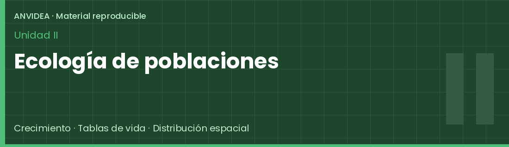
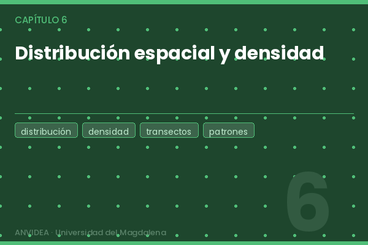

<div style="text-align:center; margin: 1.5rem 0 1rem;">
  
  <p style="color:#4a6282; font-size:0.9rem; margin-top:0.7rem;">Material reproducible · ANVIDEA · Universidad del Magdalena</p>
</div>

<div style="margin-bottom:2rem;">
  
</div>

Esta unidad integra herramientas cuantitativas para el análisis de la **dinámica poblacional**, desde modelos de crecimiento hasta el análisis espacial de poblaciones.

---

## Empezar aquí

<div class="pasos">
  <div class="paso"><div class="paso-num">1</div><p>Descarga el material y descomprímelo</p></div>
  <div class="paso"><div class="paso-num">2</div><p>Abre <code>unidad_ii/</code> en RStudio</p></div>
  <div class="paso"><div class="paso-num">3</div><p>Instala los paquetes requeridos</p></div>
  <div class="paso"><div class="paso-num">4</div><p>Ejecuta <code>run_unidad2.R</code></p></div>
</div>

::: {.callout-note}
Este portal no ejecuta código. Todos los análisis se realizan de forma local en RStudio.
:::

---

## Capítulos

```{=html}
<div class="card-unidad">
  <div style="display:grid; grid-template-columns:180px 1fr; gap:1.2rem; align-items:start;">
    
    <div>
      <h3 style="margin-top:0;">Capítulo 4 — Modelos de crecimiento poblacional</h3>
      <p>Crecimiento exponencial, discreto y logístico. Modelación y ajuste de parámetros demográficos.</p>
      <span class="badge-tema">Exponencial</span>
      <span class="badge-tema">Logístico</span>
      <span class="badge-tema">Discreto</span><br>
      <a class="btn-anvidea" href="https://github.com/Javier-2712/libro_anvidea/tree/main/unidad_ii/cap4-modelos-crecimiento" target="_blank" style="margin-top:0.8rem;">Ver carpeta →</a>
    </div>
  </div>
</div>

<div class="card-unidad">
  <div style="display:grid; grid-template-columns:180px 1fr; gap:1.2rem; align-items:start;">
    
    <div>
      <h3 style="margin-top:0;">Capítulo 5 — Tablas de vida y modelos matriciales</h3>
      <p>Tablas de vida por edades y estados, proyecciones con matrices de Leslie y Lefkovitch.</p>
      <span class="badge-tema">Tablas de vida</span>
      <span class="badge-tema">Leslie</span>
      <span class="badge-tema">Lefkovitch</span><br>
      <a class="btn-anvidea" href="https://github.com/Javier-2712/libro_anvidea/tree/main/unidad_ii/cap5-tablas-vida" target="_blank" style="margin-top:0.8rem;">Ver carpeta →</a>
    </div>
  </div>
</div>

<div class="card-unidad">
  <div style="display:grid; grid-template-columns:180px 1fr; gap:1.2rem; align-items:start;">
    
    <div>
      <h3 style="margin-top:0;">Capítulo 6 — Distribución espacial y densidad</h3>
      <p>Análisis de patrones de distribución y estimación de densidad poblacional.</p>
      <span class="badge-tema">Distribución espacial</span>
      <span class="badge-tema">Densidad</span>
      <span class="badge-tema">Transectos</span><br>
      <a class="btn-anvidea" href="https://github.com/Javier-2712/libro_anvidea/tree/main/unidad_ii/cap6-distribucion-densidad" target="_blank" style="margin-top:0.8rem;">Ver carpeta →</a>
    </div>
  </div>
</div>
```

---

## Acceso al material

<a class="btn-anvidea btn-verde" href="https://github.com/Javier-2712/libro_anvidea/archive/refs/heads/main.zip" target="_blank">⬇ Descargar repositorio completo (ZIP)</a>
<a class="btn-anvidea btn-outline" href="https://github.com/Javier-2712/libro_anvidea/tree/main/unidad_ii" target="_blank">Ver Unidad II en GitHub</a>

---

## Ejecución

```r
# Desde unidad_ii/ en RStudio
source("run_unidad2.R")

# O capítulo por capítulo
source("cap4-modelos-crecimiento/run_cap4.R")
source("cap5-tablas-vida/run_cap5.R")
source("cap6-distribucion-densidad/run_cap6.R")
```

---

## Paquetes requeridos

```r
install.packages(c(
  "tidyverse", "readxl", "writexl",
  "patchwork", "kableExtra", "MASS", "broom"
))
```

---

<div class="footer-anvidea">
  <a href="../index.qmd">← Volver a la página principal</a>
</div>
